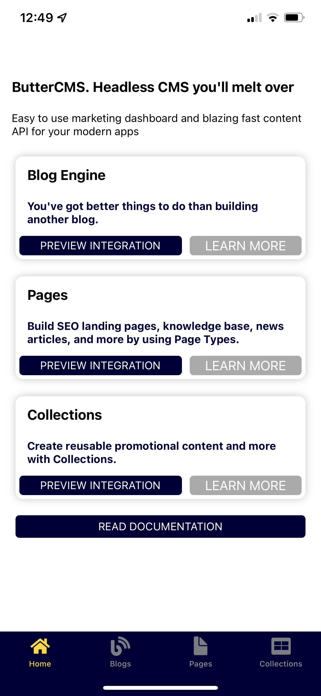
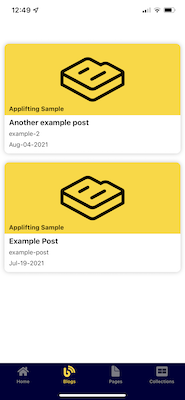
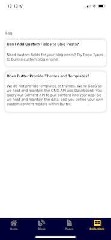
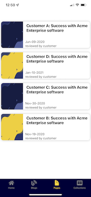

# ButterCMSSDK sample application
ButterCMS is a headless CMS which provides content through REST APIs. The [Swift ButterCMSSDK](https://github.com/ButterCMS/buttercms-swift) simplifies interaction with those REST APIs. 

The sample application is implemented for iOS 14 or higher. It does not support dark mode. 






The app is connected to a sample ButterCMS instance. It demonstrates usage of the following main object available in ButterCMS:

* Pages
* Blog posts
* Collections

ButterCMSSDK automatically deserializes json data received from REST APIs. Where Blog posts have a fixed data model the Pages and Collections have to be fine-tuned by generics. There are two models for pages:

* [HomePage](ButterCMSSample/Model/HomePageFields.swift) 
* [CaseStudyPage](ButterCMSSample/Model/CaseStudyPageFields.swift) 

and one model for Collection:
    
* [Faq](ButterCMSSample/Model/FaqCollectionItem.swift)
    
The configuration of the ButterCMSSDK and calls of individual APIs can be found in [ButterCMSManager.swift](ButterCMSSample/Managers/ButterCMSManager.swift).

# Getting started
 - Download Sample application from GitHub
    ```
    git clone https://github.com/ButterCMS/buttercms-ios.git
    ``` 
 - Open file ButterCMSSample.xcodeproj in XCode
 - Build and Run

## Amend to your needs

First of all you need to point the ButterCMSSDK to your ButterCMS instance. For that you need to change apikey in ButterCMSManager.swift. Then you need to change models to reflect you configuration of pages, collections and posts. You can find existing ones in folder Model. For example this is the Case study page model:

```
struct CaseStudyPageFields: Codable {
    var title: String
    var content: String
    var industry: String
    var subindustry: String
    var featuredImage: String
    var reviewer: String
    var studyDate: Date
}
```

This model corresponds to Case studies page schema in ButterCMS:


## What next
Now you have the data and networking layer prepared. The rest of the chnages are not that generic and simple as they are related to how your application shall looks like and what it shall do. You have to tailor ViewModels and Views to your need. Here you also may want to use completly different architecture perhaps based on SwiftUI rather than UIKit etc. 
